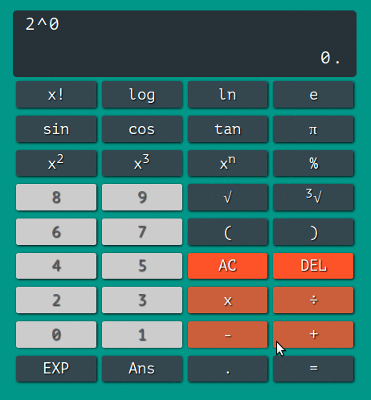

# calculator

Quick show

[Go to proof](https://rich-97.github.io/calculator)

## Easy installation

1. Clone the repo.
2. Install de dependencies `npm install && bower install`.
3. Build the assets with `gulp`.
